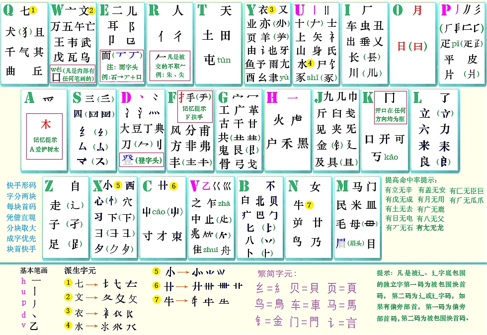

# 自用的 Rime 中州韵配置
配置在 luna_zrku 目录

# 特性说明
自然码双拼 + 辅码 + 英文 + 自己觉得够用的词库, 有类似需求的小伙伴可以参考

自然码的码表不是用全拼 + Rime的代数运算得到的, 而是直接用自然码对应单字, 这样就不会和英文的码表冲突了
由于只收录了单字的发音, 会出现多音字打错对应的发音仍然出词的情况, 比如 igih 能出成长
这不是我期望的特性, 不过懒得弄所以随他去了.

# 辅码
辅码方案来自
https://github.com/functoreality/rime-flypy-zrmfast

从他的注释里看, 又是来自华宇拼音输入法论坛的ID 为紫光蓝天的网友发布的
http://bbs.pinyin.thunisoft.com/forum.php?mod=viewthread&tid=28002

并不了解这位网友, 但是感觉辅码还挺好用的, 图也做得不错, 就用了

# 码表翻译器
按照 Rime 的[官方文档](https://github.com/rime/home/wiki/RimeWithSchemata#%E7%90%86%E8%A7%A3-translators)
它的翻译器有两种 script_translator 主要用于音码, table_translator 主要用于形码.
但是带辅码的双拼是音形结合的, 加上我其实没太看明白两种到底有什么区别, 所以选择的时候纠结了一阵.
参考别人的方案 [functorreality](https://github.com/functoreality/rime-flypy-zrmfast
) 用的是 script, [motue](https://github.com/mutoe/rime) 用的是 table_translator.

我实际用下来 script_translator 无法理解的行为比较少, 就用script_translator了

# 词库
原来想让词库大一些, 就加上了汉语大词典的词库, 可是没有词频信息的情况下大词库带来了很多干扰项, 只用了成语诗文和历史词库. 熟用辅码的话公共词库用处应该不算大

# 中英混合
中英混合参考 [三十年河东](https://ssnhd.com/2022/01/06/rime/) 的配置. 他的方案全拼下有中英混合, 改双拼就没了. 我的理解是由于他方案里的双拼依靠 Rime引擎的代数运算实现.
代数运算连英文也一起算了, 英文就用不了了. 我这里事先把码表换成了自然码了, 就没有这种冲突了.

# 其他功能
没有其他功能😂.
想要丰富些的功能可以看 [三十年河东](https://ssnhd.com/2022/01/06/rime/) 或者 [functorreality](https://github.com/functoreality/rime-flypy-zrmfast
).
对于 Rime 来说, 省心和符合口味不可得兼.